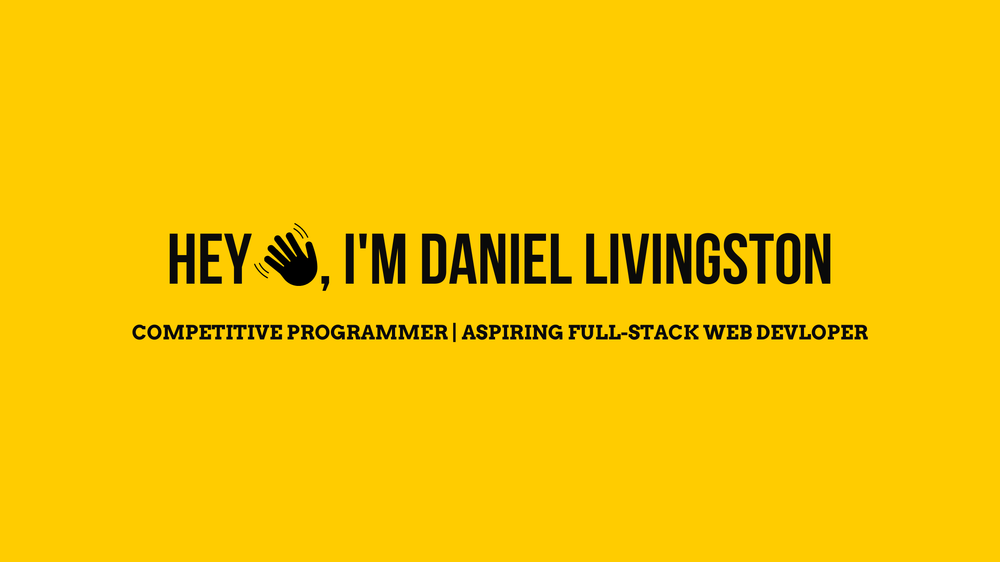

---

<b>Welcome to my page!<b>

- 🔭 I’m currently working on **Concurrent Traffic Simulation using C++**
- 🌱 I’m currently learning **Algorithms for Competitive Programming**
- 💬 Ask me about **Data Structures and Algorithms and C++**
- 📫 Reach me on [Linkedin](https://www.linkedin.com/in/michael-hoffmann-3b8933b1)

---

<h2>Language I Code With:</h2>

---

<h2>GitHub Stats</h2>

